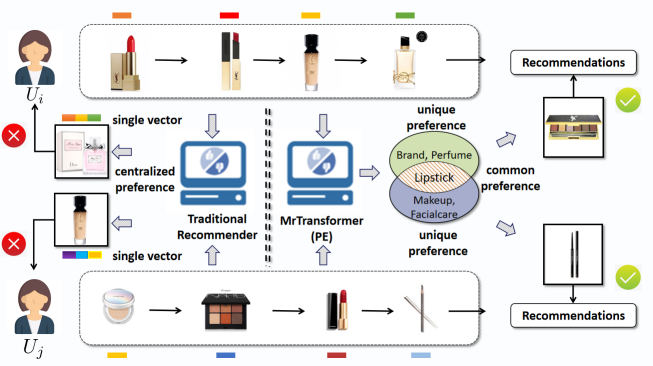
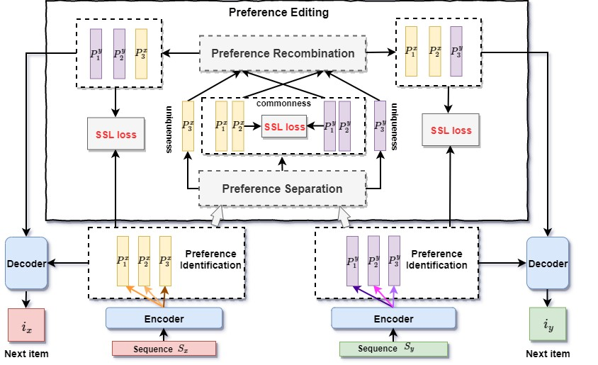

# MrTransformer: Improving Transformer-based Sequential Recommendersthrough Preference Editing

by *Muyang Ma, Pengjie Ren, Zhumin Chen, Zhaochun Ren, Huasheng Liang, Jun Ma and Maarten de Rijke*

>>@inproceedings{ma2021MrTransformer,\
>>title={Improving Transformer-based Sequential Recommendersthrough Preference Editing},\
>>author={Ma, Muyang and Ren, Pengjie and Chen, Zhumin and Ren, Zhaochun and Liang, Huasheng and de Rijke, Maarten},\
>>booktitle={Arxiv 2021},\
>>year={2021}\
>>}

## Paper Summary

\
*Schematic comparison of a traditional recommender system and MrTransformer (PE).*\
\
*Overview of preference editing learning.*

In this work, we aim to force the sequential recommendation (SR) model to discriminate the common and unique preferences in different sequences of interactions between users and the recommender system. To achieve it, we propose a transformer based SR model, named **M**ulti-p**r**eference **Transformer** (MrTransformer), that concatenates some special tokens in front of the sequence to represent multiple user preferences and makes sure they capture different aspects through a preference coverage mechanism. Then, we devise a *preference editing*-based self-supervised learning (SSL) mechanism for training MrTransformer that contains two main operations: *preference separation* and *preference recombination*. The former separates the common and unique user preferences for a given pair of sequences. The latter swaps the common preferences to obtain recombined user preferences for each sequence. Based on the preference separation and preference recombination operations, we define two types of SSL loss that require that the recombined preferences are similar to the original ones, and that the common preferences are close to each other.

## Running experiments
This code is written in Tensorflow 1.14.0. \
Python version = 3.6 \
Model is trained on a GeForce GTX TitanX GPU.


### Datasets
We conduct experiments on five datasets in different domains:  
+ [Amazon (Beauty, Sports, Toys)](http://jmcauley.ucsd.edu/data/amazon/): These three datasets are obtained from Amazon product review datasets.  
+ [ML-100k](https://grouplens.org/datasets/movielens/):This is a popular benchmark dataset for recommendation evaluation. We adopt a well-established version, ML-100k.   
+ [Yelp](https://www.yelp.com/dataset):This is a popular dataset for business recommendation.  

### Training instructions

We take ''Yelp'' dataset as example. It's same for other datasets.

1. run “gen_data_yelp_faiss_p1.py” to get yelp learning data (same as other datasets), where “gen_data_yelp_faiss_p1.py” is used to process data and generate the learning data, and the “util.py” and “vocab.py” are auxiliary code.  

```
sbatch gen_data_yelp_p1.bash
```

2. run “run_yelp_pretrain.py” to pretrain the model of yelp data. (same as other datasets), where “modeling_coverage_learning_loss.py” is our model file, and “optimization.py” is our optimization file.  

```
sbatch run_yelp_learning_pretrain_p1.bash
```

3. run “run_yelp_finetune.py” to finetune the model of yelp data by initializing the model parameters as the pretrain model (same as other datasets).

```
sbatch run_yelp_learning_finetune_p1.bash
```
